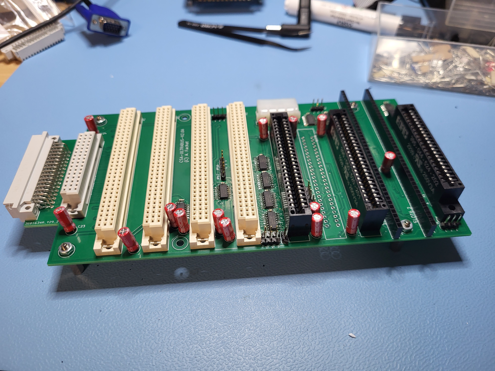
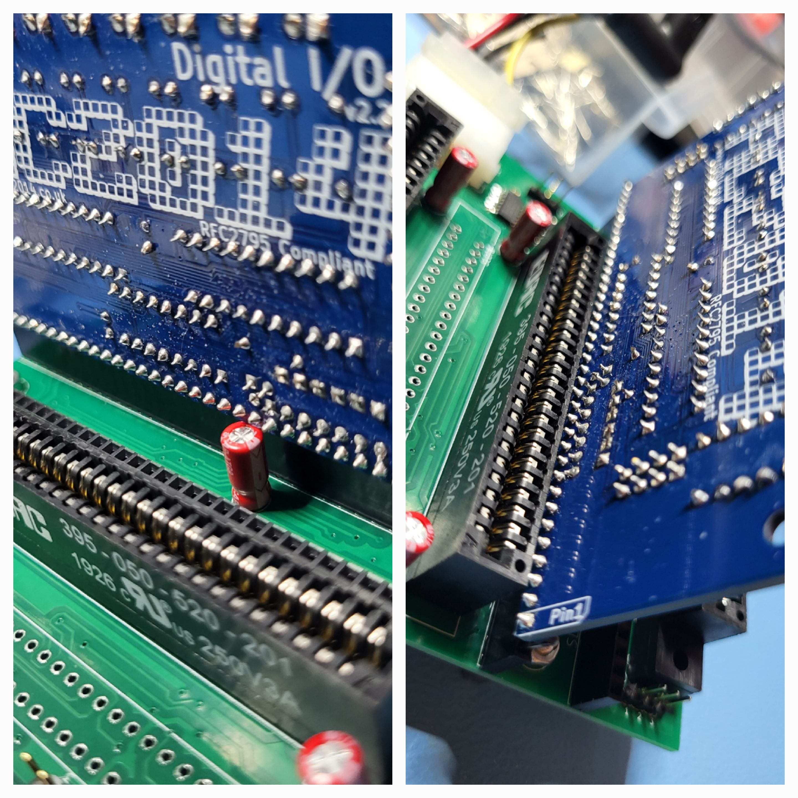
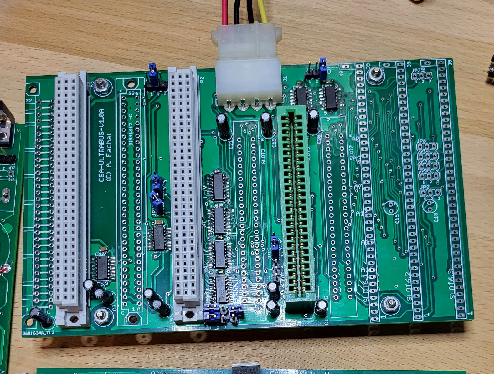
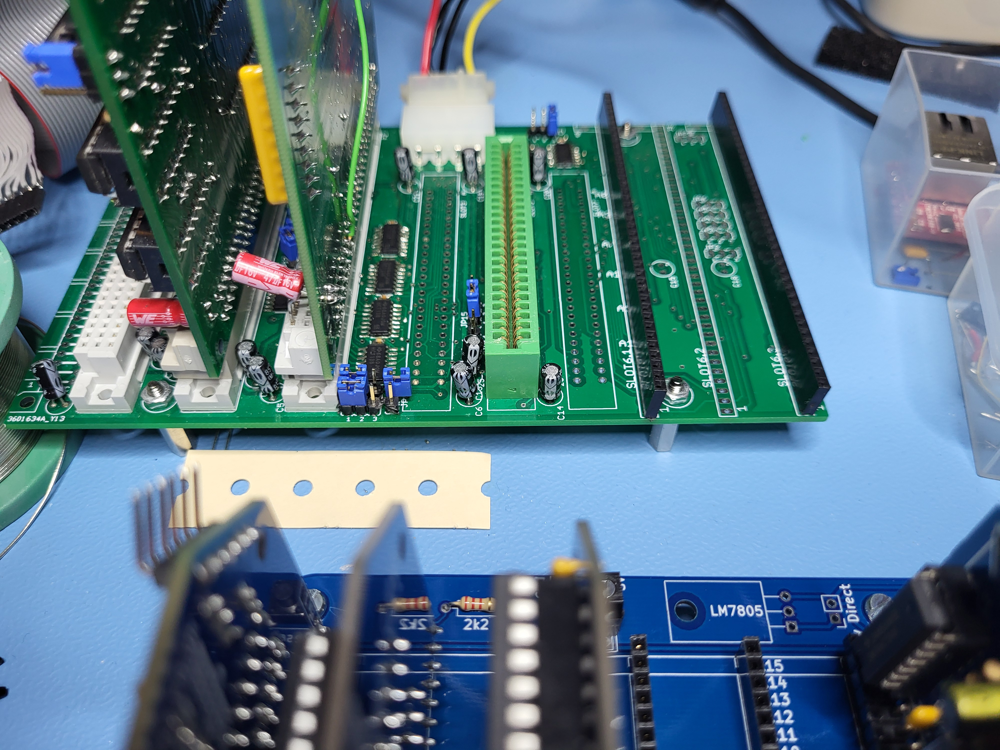

= csa_ultrabus
A backplane for CS/A, Apple II and RC2014 boards

Note: this can be used stand-alone, but is also a part of a larger set of repositories, with https://github.com/fachat/upet_family[upet_family] as the main repository.

The purpose of this backplane is to cross-enable the use of Apple II expansion cards and RC2014 boards 
on the CS/A65 bus http://www.6502.org/users/andre/csa/bus-1.1.html 

== General Discussion

The board combines three different types of busses:

CS/A65 bus:: 
	A 6502-based bus, with specific select lines and features.
	As, the main CPU uses an MMU, it has 20 address lines (A0-A19)
	to accomodate 1MByte of address space, and using the /MEMSEL
	line to select access to that space. Bank selection needs
	to be taken into account when accessing cards on the other 
	busses. A second select line /IOSEL selects a separate I/O space.
	It is 2k in size, but cards should preferrably be in the first
	256 byte.
	The rev 2 boards now have the long CS/A connectors, as well as 
	the short CS/A connectors. They are also specifically made to be
	used as extension bus to the [Ulti-PET](https://github.com/fachat/cbm_ultipet) machine.

Apple II::
	Apple II expansion slots are also 6502-based. The Apple II uses
	geographic addressing, i.e., each slot has a defined address 
	independent from which card is inserted. This means that address
	selection logic must be included on the board.

RC2014::
	This actually is a Z80-based bus, but boards exist that are
	actually built on 65xx/68xx-based chips - like the 6850-based
	serial interface card. The bus interface is severely different
	with /RD and /WR instead of R/-W and clock.
	Some boards even require timing on the select lines (only
	available on one RC2014 slot here)
	This has to be taken into account.

RC6502::
	This is a variation of the RC2014 bus. Unfortunately it is a 
	very raw mapping of the 6502 bus signals onto the bus.
	Therefore, it does not provide the ability to select specific
	memory areas. As it has 64k address space only, it is 
	only useful if an Apple II CPU is used, or the RC6502 is the
	CPU itself.

== Use Cases

=== CS/A main CPU using A2 and RC2014 boards

The CS/A main CPU uses a 6502, and has an MMU that extends the upper four
bits of the CPU address bus into eight bits, to create a physical 
address space of 1M, that can be selected on the bus.

As the typical system (e.g. PETCPU, or CPU+BIOS) fully occupies the
bank zero space (the lowest 64k on the bus address space),
the memory on the cards on the other busses have to be mapped into some other bank.
This can be done using jumpers.

For A2 boards, the I/O space is set to $02Cxxx, with the special geographic addressing taking place.
So, in the second 128 bytes all the I/O of the cards is located ($C08x-$C0Fx). These 128 byte can be
mapped into memory like in the Apple II, but also onto the /IOSEL space.

Memory access via the /MEMSEL line can be mapped to the /MREQ address space on the RC2014 line.
The /IOSEL line can be mapped to the /IOREQ address space on the RC2014
bus. 

=== CS/A UltraCPU using A2 and RC2014 boards

The UltraCPU works similar to the CS/A main CPU. Internally it uses all of bank zero.
It has one feature, however, that allows it to open up a window to the bus at either
$9xxx or $Cxxx. 

Therefore, the Apple II I/O window can be re-mapped to $009xxx or $00Cxxx on the CS/A bus.

=== Apple II DMA on a CS/A CPU/UltraCPU

Apple II cards can ask for a DMA slot, by pulling the /DMA line down. This separates the CS/A CPU
from the bus - i.e., puts the address, data, and control lines R/-W, /MEMSEL, /IOSEL, SYNC into high
impedance mode on the CPU board. The Apple II card then has to take over these lines.
As /MEMSEL does not exist on the A2 Bus, and the CS/A bus has four more address lines, these
lines are pulled low to auto-create an access to bank zero for any DMA triggered by an Apple II board.

This also enables the /MREQ address space on the RC2014 boards, so memory on these boards
can be used as well. Care has to be taken to not create bus conflicts by overlapping
address spaces.

It should be noted that any memory on a CPU board - UltraCPU specifically - cannot be 
addressed this way. Also, the CS/A PETCPU board lacks this feature. So, this is only
useful for a CPU+MMU+BIOS board system.

=== Apple II using CS/A and RC2014 boards

If there is a CPU board on the A2 bus that wants to take over the whole bus, no CPU board must be
plugged into the CS/A bus. Also, the /DMA feature must be jumpered permanently, to enable
addressing bank zero, and mapping the Apple II slot I/O onto $Cxxx.

This also enables the /MREQ address space on the RC2014 boards, so memory on these boards
can be used as well. Care has to be taken to not create bus conflicts by overlapping
address spaces.

To access CS/A I/O boards, the /IOSEL line needs to be jumpered to /SLOT2IO, so that it is mapped into 
the 256 byte of the Apple II slot 2 ROM space (the Ultrabus offers slots 3, 5, and 7)

To access RC2014 boards, the /IOREQ line must be jumperred to /SLOT6IO, mapping the 256 byte I/O space
into the 256 byte for Apple II slot 6 ROM.

=== RC6502 CPU using Apple II and CS/A boards

There is only one RC6502 slot available, by jumpering one of the RC2014 slots into an RC6502.
As the RC6502 is basically a 6502 bus, A16-A19 and /MEMSEL have to be jumpered to low similar
to the Apple CPU case. Also, the I/O slots are then available using the same mapping as
when the Apple II CPU is a bus master.

=== RC2014 CPU

Using an RC2014 CPU is NOT possible on this board.

== Build

To get the board built, KiCad schematics, gerber files, and a BOM with Mouser part numbers are provided in the repository.

== Revision History

- [R1.0A](https://github.com/fachat/csa_ultrabus/tree/r1.0a): the original Euro-PCB board. Built with Eagle

== Gallery

 

 

=== Rev 1.0

 

 

